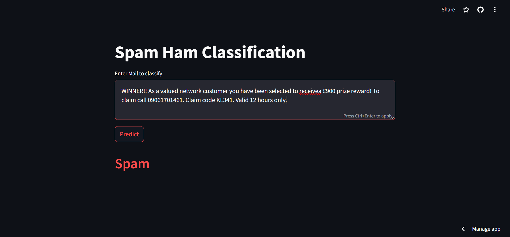
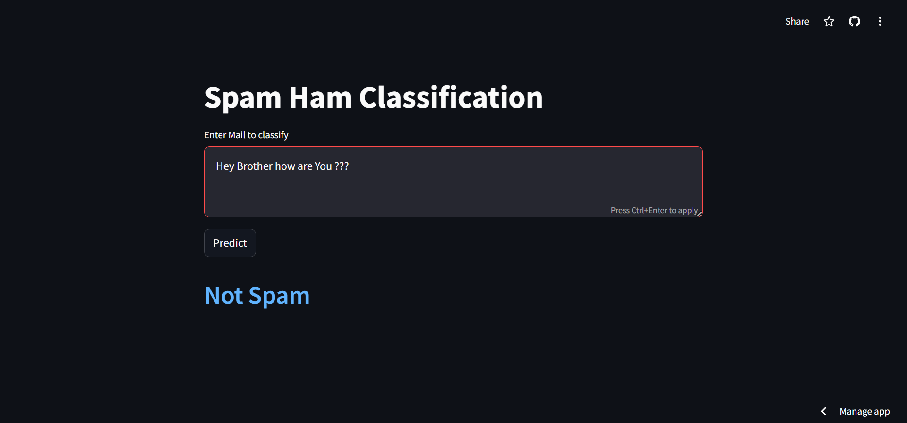

---

# Email Spam Classification

This project is a web application built using Streamlit that classifies emails as either "Spam" or "Not Spam". The classification model is based on machine learning techniques and is trained to recognize patterns in text data that are indicative of spam.

## Features

- **Real-time Classification**: Classify an email as spam or not spam instantly.
- **Text Preprocessing**: The input email is preprocessed using techniques like tokenization, stemming, and removal of stopwords.
- **Interactive Interface**: User-friendly interface powered by Streamlit.

## Installation

To run this project locally, follow these steps:

## Screenshots







1. **Clone the repository:**

   ```bash
   git clone https://github.com/your-username/email-spam-classification.git
   cd email-spam-classification
   ```

2. **Install the required packages:**

   Make sure you have Python installed. Then, install the required packages using pip:

   ```bash
   pip install -r requirements.txt
   ```

3. **Download NLTK stopwords:**

   ```python
   import nltk
   nltk.download('stopwords')
   ```

4. **Run the Streamlit app:**

   ```bash
   streamlit run app.py
   ```

## Usage

1. Enter the email text you want to classify in the text area provided.
2. Click the "Predict" button to see if the email is classified as "Spam" or "Not Spam".

## Project Structure

- `app.py`: The main file that runs the Streamlit application.
- `model.pkl`: The pre-trained machine learning model used for classification.
- `vectorizer.pkl`: The TF-IDF vectorizer used to transform the text data.
- `requirements.txt`: The list of dependencies required to run the project.

## How It Works

- The email text is first preprocessed by:
  - Converting to lowercase
  - Tokenizing the text into words
  - Removing stopwords and punctuation
  - Applying stemming using the PorterStemmer

- The processed text is then transformed using a TF-IDF vectorizer.
- The transformed text is fed into a pre-trained machine learning model to predict whether the email is spam or not.

## Example

Here's a quick example of how to use the application:

1. Enter a sample email text:
   ```
   Congratulations! You've won a $1000 gift card. Click here to claim your prize!
   ```

2. Click "Predict" and the app will classify it as "Spam".

## Contributing

If you'd like to contribute to this project, feel free to fork the repository and submit a pull request. Please make sure your contributions are well-tested.

## License

This project is licensed under the MIT License. See the [LICENSE](LICENSE) file for more details.

## Acknowledgements

- [NLTK](https://www.nltk.org/) for providing the tools for text preprocessing.
- [Streamlit](https://www.streamlit.io/) for making it easy to create interactive web applications.

---
